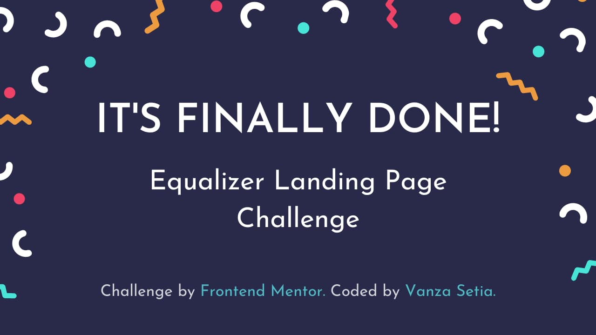

# Equalizer Landing Page

## Disclaimer

This project is solely for learning purposes. I take no any responsibility or liability for the accuracy, completeness, or usefulness of any information provided in this project. You should not use it as a reference for creating your project.

I am currently no longer working on this project.

## Overview

### Introduction

Welcome to the `README.md` of this repo! The purpose of creating this project is to sharpen my coding skill.

In this file I'm going to tell you everything, starting from tools that I used, and much more.

That's it for the introduction and **happy reading!**

### The Challenge

My challenge is to build out this landing page and get it looking as close to the design as possible.

My users should be able to:

- View the optimal layout depending on their device's screen size
- See hover states for interactive elements
- See visible focus states for interactive elements when navigating by keyboard
- Understand and be able to navigate page content while using assistive technology

### Links

- [Live Review](https://officialequalizer.netlify.app/)
- [Frontend Mentor Solution Page](https://www.frontendmentor.io/solutions/equalizer-landing-page-html-css-sass-0JTUm8wvt)

## My Process

### Built With
- **Following best practices**\* 
- HTML Semantic Tags
- [BEM (Block, Element, Modifier)](https://sparkbox.com/foundry/bem_by_example) Class *Naming Convention*
- [Sass](https://sass-lang.com/)
- CSS Flexbox
- Mobile-first workflow
- [Normalize.css](https://necolas.github.io/normalize.css/)
- Netlify - site hosting and [asset optimization](https://www.netlify.com/blog/2019/08/05/control-your-asset-optimization-settings-from-netlify.toml/)

> \* I follow guidelines. [See what guidelines that I follow.](./docs/README.md#guidelines)

## License

[MIT](./LICENSE)

## References

See the [documentation.](./docs/README.md)
